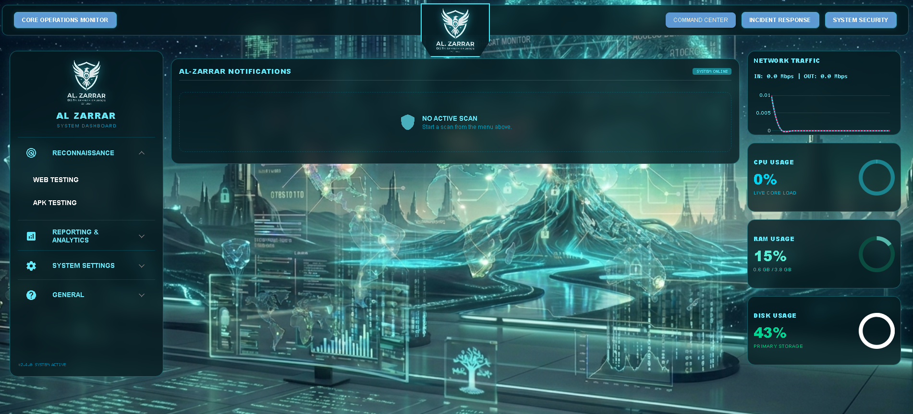
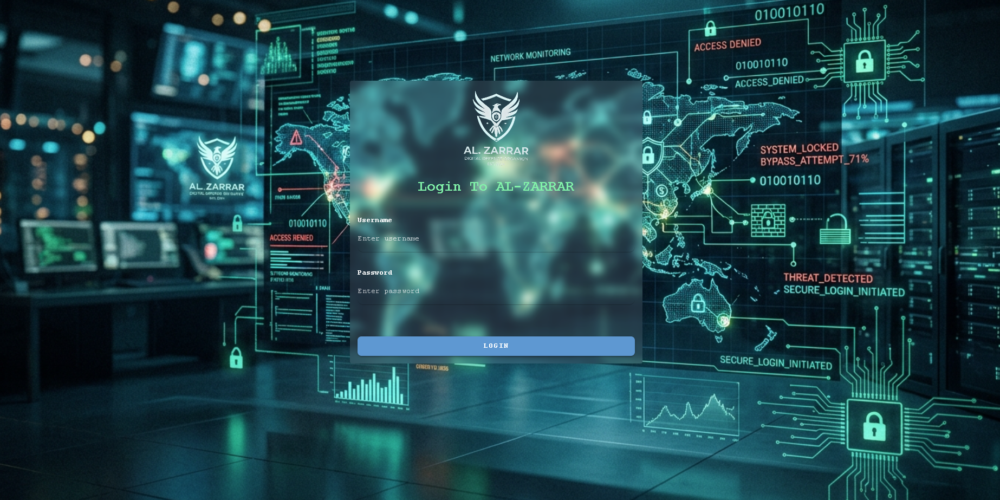
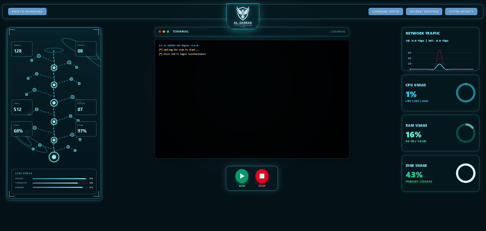
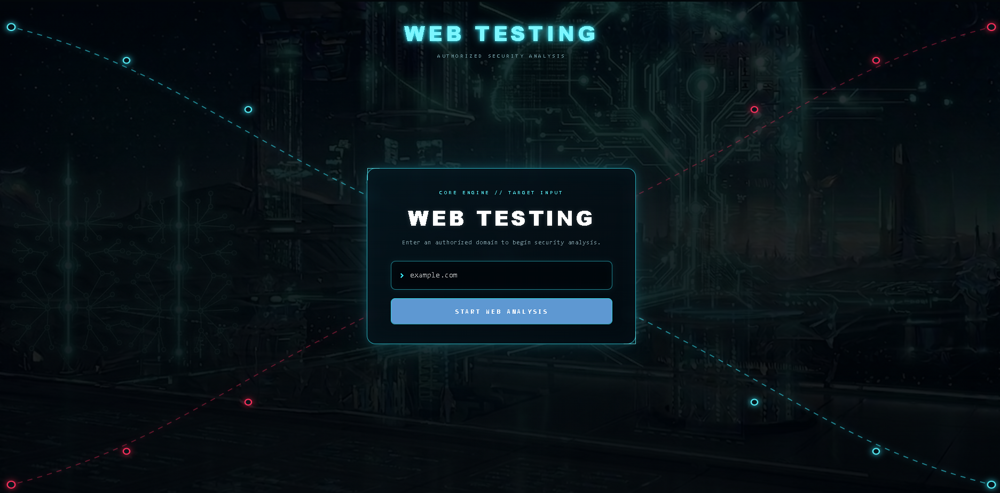
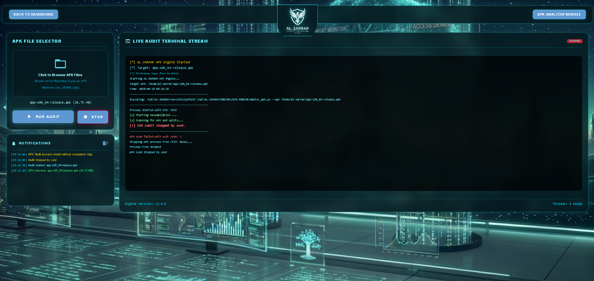
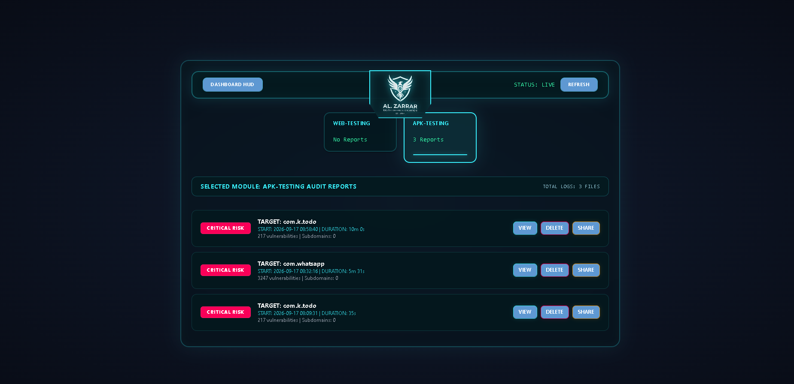
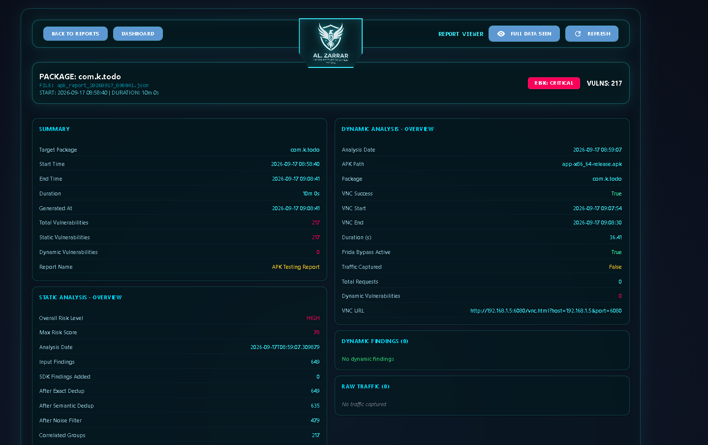
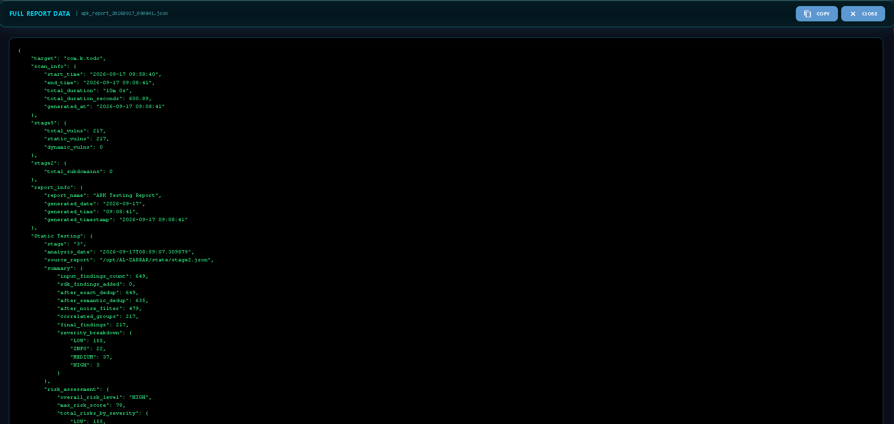

# AL-ZARRAR

### Offensive Security Automation Suite

**Web Application Security Scanner + Android APK Security Analyzer + Security Monitoring Dashboard**

<p align="center">
  <strong>AL-ZARRAR v2.4.0</strong><br>
  A self-hosted security automation platform for web application and Android APK security testing.
</p>

---

## Overview

**AL-ZARRAR** is a private, self-hosted cybersecurity automation platform designed to bring multiple security testing capabilities into a single browser-based interface.

The platform combines:

- Web application security testing
- Android APK static analysis
- Android APK dynamic analysis
- Runtime traffic interception
- Security report generation
- Security alerts and notifications
- Resource monitoring
- Centralized logging
- Browser-based testing interfaces
- Automated email reporting

The project was designed as a modular security platform where different engines operate independently while sharing a common frontend, reporting, logging, and deployment architecture.

> **Note:** AL-ZARRAR is a private project. The source code is not publicly distributed. This repository/documentation is intended to showcase the project's architecture, capabilities, interface, and engineering work.

---

# Visual Preview

## Main Dashboard

<p align="center">
  
</p>

The main dashboard provides a centralized interface for accessing the platform's security engines, reports, monitoring capabilities, and system resources.

---

# Key Capabilities

### Web Security Engine

- Automated web reconnaissance
- Subdomain discovery
- Subdomain takeover analysis
- Deep web application analysis
- Path and endpoint discovery
- Web crawling
- High-speed custom scanning
- Nuclei-based vulnerability detection
- Result merging
- Automated JSON report generation

### Android APK Security Engine

- APK decompilation
- Static source/resource analysis
- Android security intelligence
- Manifest and permission analysis
- Dynamic application analysis
- Runtime traffic interception
- SSL/TLS runtime analysis
- Frida-assisted instrumentation
- Automated report generation

### Platform Features

- Browser-based GUI
- Authentication
- Centralized reports
- Full JSON report viewer
- Alert notifications
- Email reporting
- Live resource monitoring
- Centralized logging
- Automated deployment
- Clean-state execution architecture

---

# Authentication

AL-ZARRAR includes a dedicated authentication interface before accessing the main platform.

<p align="center">
  
</p>

The login interface provides the entry point to the security platform and separates the protected application interface from unauthenticated users.

---

# Architecture

The platform is organized around multiple independent security and monitoring components.

```text
                         ┌──────────────────────────┐
                         │       AL-ZARRAR GUI      │
                         │       Browser Client     │
                         └────────────┬─────────────┘
                                      │
                    ┌─────────────────┼─────────────────┐
                    │                 │                 │
                    ▼                 ▼                 ▼
             ┌─────────────┐  ┌─────────────┐  ┌──────────────┐
             │ Web Engine  │  │ APK Engine  │  │ Monitoring   │
             │             │  │             │  │ Dashboard    │
             └──────┬──────┘  └──────┬──────┘  └──────────────┘
                    │                 │
                    ▼                 ▼
             ┌─────────────┐  ┌─────────────┐
             │ Web Stages  │  │ APK Stages  │
             │ 1 → 6      │  │ 1 → 5       │
             └──────┬──────┘  └──────┬──────┘
                    │                 │
                    └────────┬────────┘
                             ▼
                    ┌──────────────────┐
                    │ Report Generation │
                    │ JSON Reports      │
                    └────────┬─────────┘
                             │
                             ▼
                    ┌──────────────────┐
                    │ Report Viewer     │
                    │ Alerts / Email    │
                    └──────────────────┘
```

---

# Technology Stack

## Core

- Python
- Rust
- Go
- Shell scripting

## Web Interface

- NiceGUI
- FastAPI
- Uvicorn
- Tailwind CSS
- Custom CSS
- Plotly

## Web Security

- Nuclei
- Custom Rust scanner
- Web crawlers
- Subdomain enumeration tools
- Reconnaissance components

## Android Security

- Android SDK
- ADB
- Android Emulator
- apktool
- JADX
- AAPT / AAPT2
- Androguard
- Frida
- mitmproxy / mitmdump

## Dynamic Analysis Infrastructure

- KVM
- Xvfb
- x11vnc
- websockify
- noVNC
- SwiftShader
- Android Emulator

## System Monitoring

- psutil
- Linux system utilities
- Network/resource telemetry

---

# Web Security Engine

The Web Security Engine is designed as a multi-stage automated web application security pipeline.

## Web Engine Pipeline

```text
Target Domain
     │
     ▼
Stage 1
Basic Reconnaissance
     │
     ▼
Stage 2
Subdomain / Takeover Analysis
     │
     ▼
Stage 3
Deep Web Analysis
     │
     ▼
Stage 4
Path Extraction / Crawling
     │
     ▼
Stage 5
High-Speed Rust Scanner
     │
     ▼
Stage 6
Nuclei + Result Merge
     │
     ▼
Final JSON Report
```

## Web Engine Stages

### Stage 1 — Basic Reconnaissance

Collects initial information about the target and establishes the starting point for further security analysis.

### Stage 2 — Subdomain & Takeover Analysis

Performs subdomain discovery and analyzes discovered infrastructure for potential takeover-related conditions.

### Stage 3 — Deep Analysis

Performs deeper inspection of the target web application and gathers additional security-relevant information.

### Stage 4 — Path Extraction & Crawling

Discovers paths, endpoints, links, and additional application surface through crawling and extraction.

### Stage 5 — Rust Fast Scanner

Uses a custom high-performance Rust component for faster security scanning and processing.

### Stage 6 — Nuclei & Result Merger

Combines the collected information and performs template-based security testing through Nuclei before generating the final report.

---

# Web Security Interface

## Web Dashboard

<p align="center">
  
</p>

The Web Security interface provides access to web testing functionality and the generated security results.

---

## Web Target Input

<p align="center">
  
</p>

The target input interface is used to provide the web application or domain that should be tested.

---

# Android APK Security Engine

The APK Security Engine provides a multi-stage workflow for analyzing Android applications.

## APK Engine Pipeline

```text
APK Input
   │
   ▼
Stage 1
Decompilation
   │
   ▼
Stage 2
Static Analysis
   │
   ▼
Stage 3
Security Intelligence
   │
   ▼
Stage 4
Dynamic Analysis
   │
   ▼
Stage 5
Merge + Report + Cleanup
   │
   ▼
Final APK Security Report
```

---

## APK Engine Stages

### Stage 1 — Decompilation

Processes the APK and prepares application resources and code for further analysis.

### Stage 2 — Static Analysis

Analyzes the application's static structure, resources, permissions, components, and security-relevant artifacts.

### Stage 3 — Security Intelligence

Extracts and organizes security-related information from the application.

### Stage 4 — Dynamic Analysis

Executes the application in an Android environment and observes runtime behavior.

Dynamic analysis can involve:

- Android Emulator
- ADB
- Frida
- mitmproxy
- Logcat
- Runtime instrumentation
- Network traffic inspection

### Stage 5 — Result Merger

Combines analysis results, generates the final report, performs cleanup, and can trigger automated reporting.

---

# APK Dashboard

<p align="center">
  
</p>

The APK dashboard provides access to Android application security analysis and its associated results.

---

# Dynamic Android Analysis

One of the major components of AL-ZARRAR is its dynamic Android testing environment.

The platform can integrate:

```text
Android Emulator
      │
      ├── ADB
      │
      ├── Frida
      │
      ├── Logcat
      │
      └── Application Runtime
               │
               ▼
          mitmproxy
               │
               ▼
        Network Traffic
               │
               ▼
        Security Analysis
```

This allows runtime behavior to be inspected in addition to static APK analysis.

---

# Browser-Based Android Environment

AL-ZARRAR can expose the Android testing environment through a browser-based interface.

The infrastructure can use:

- Xvfb
- Android Emulator
- KVM
- x11vnc
- websockify
- noVNC

This allows an analyst to interact with the testing environment through a browser instead of requiring direct access to the graphical host session.

---

# Runtime SSL / Traffic Analysis

The dynamic analysis environment can integrate runtime instrumentation and traffic interception components.

The workflow may include:

```text
Android Application
        │
        ▼
   Runtime Execution
        │
        ▼
      Frida
        │
        ▼
   SSL/TLS Analysis
        │
        ▼
    mitmproxy
        │
        ▼
  HTTP/HTTPS Traffic
        │
        ▼
 Security Processing
```

This provides visibility into application behavior and network communication during dynamic testing.

---

# Reporting System

AL-ZARRAR generates structured JSON reports for security testing operations.

Reports can contain information gathered from multiple stages of the testing pipeline.

## Web Reports

Web reports are generated under:

```text
Reports/WEB-TESTING/
```

Example format:

```text
<domain>_<timestamp>_report.json
```

## APK Reports

APK reports are generated under:

```text
Reports/APK-TESTING/
```

Example format:

```text
apk_report_<timestamp>.json
```

---

# Reports Interface

## Reports Page

<p align="center">
  
</p>

The reports interface provides a centralized location for previously generated security reports.

---

## Report Viewer

<p align="center">
  
</p>

The report viewer provides a structured interface for opening and reviewing generated security reports.

---

## Full Report Data

<p align="center">
  
</p>

A full JSON data view is available for inspecting the underlying report structure and collected results.

---

# Alerts & Notifications

AL-ZARRAR includes an alert and notification layer designed to make important security events more visible.

The alert system can provide:

- Browser notifications
- Visual title-bar indication
- Audio notification
- Automated email reporting

The browser audio notification system uses the Web Audio API to generate a multi-tone alert sequence.

---

# Email Reporting

Generated security results can be integrated with an automated email reporting workflow.

This allows completed security analysis to be delivered without requiring the user to manually open the application after every scan.

---

# Live Resource Monitoring

The platform includes system resource monitoring for the host environment.

Monitored resources can include:

- CPU utilization
- RAM utilization
- Disk usage
- Network activity

The monitoring layer is designed to provide real-time visibility into the resources being consumed by the security platform.

---

# Centralized Logging

AL-ZARRAR uses centralized application logging.

Primary log location:

```text
Logs/AL-ZARRAR_LOGS.log
```

Centralized logging helps with:

- Debugging
- Execution tracking
- Stage monitoring
- Failure investigation
- Operational visibility

---

# Clean-State Architecture

The project follows a clean-state execution approach for major security testing operations.

The goal is to keep individual executions isolated and prevent unnecessary data from previous operations from affecting new tests.

This approach is particularly important for:

- Temporary analysis files
- Dynamic Android environments
- Generated reports
- Runtime processes
- Network interception
- Stage outputs

---

# One-Script Deployment

AL-ZARRAR is designed around an automated deployment workflow that can prepare the required environment and launch the platform.

The deployment architecture is intended to reduce the amount of manual setup required for:

- Python environment
- Dependencies
- Security tools
- Android tooling
- Runtime components
- GUI services
- Supporting infrastructure

---

# User Interface

The interface follows a dark cybersecurity-oriented design.

### Primary visual language

```text
Cyan       #00f0ff
Green      #00ffaa
Danger     #ff0055
Warning    #ffaa00
Background #0a0e1a
```

The interface emphasizes:

- Clear navigation
- Dark-theme readability
- Security-focused visual indicators
- Consistent cards and panels
- Structured reports
- Real-time information
- Minimal unnecessary UI elements

---

# High-Level Project Structure

A simplified representation of the project architecture:

```text
AL-ZARRAR/
│
├── Frontend/
│   ├── Authentication
│   ├── Dashboard
│   ├── Web Interface
│   ├── APK Interface
│   ├── Reports
│   └── Monitoring
│
├── ENGINES/
│   ├── WEB-ENGINE/
│   │   ├── master_web.py
│   │   └── stages/
│   │
│   └── APK-ENGINE/
│       ├── master_apk.py
│       └── stages/
│
├── Reports/
│   ├── WEB-TESTING/
│   └── APK-TESTING/
│
├── Logs/
│   └── AL-ZARRAR_LOGS.log
│
├── Monitoring/
│
└── Deployment/
```

> The actual private project structure contains additional internal components and implementation details that are intentionally not exposed here.

---

# Engineering Highlights

AL-ZARRAR was designed with several engineering principles in mind.

### Modular Engines

Web and Android analysis are separated into dedicated engines.

### Stage-Based Processing

Large security workflows are divided into smaller processing stages.

### Automated Orchestration

Master scripts coordinate individual analysis stages and combine their results.

### Structured Reporting

Security results are stored in machine-readable JSON format.

### Browser-Based Control

The system can be operated through a self-hosted web interface.

### Multi-Language Components

Python is used for orchestration and application logic while performance-sensitive components can use Rust or Go.

### Centralized Logging

Application and engine activity can be tracked through a common logging system.

### Automated Notifications

Security results can trigger visual, audio, browser, and email notifications.

---

# Security & Privacy

AL-ZARRAR is designed as a security testing platform for authorized environments.

The project emphasizes:

- Local/self-hosted execution
- Controlled testing environments
- Separation of analysis stages
- Structured report storage
- Controlled runtime components
- Centralized logging
- Protection of sensitive project implementation

The public documentation does not expose private implementation details, credentials, internal infrastructure, or proprietary source code.

---

# Performance

Performance-sensitive tasks can be delegated to compiled components where appropriate.

The architecture therefore allows different technologies to be used according to workload requirements:

```text
Python
  │
  ├── GUI
  ├── Orchestration
  ├── Automation
  ├── Reporting
  └── Monitoring
        │
        ▼
Rust / Go
  │
  ├── High-speed scanning
  └── Performance-sensitive processing
```

This hybrid approach allows the platform to maintain Python's development flexibility while using compiled languages for selected performance-critical workloads.

---

# Design Decisions

## Why a Stage-Based Architecture?

Security testing involves many different operations.

Separating them into stages provides:

- Easier debugging
- Better organization
- Independent processing
- Easier maintenance
- Clear execution flow
- Better result management

## Why JSON Reports?

JSON provides a structured format that can be:

- Parsed programmatically
- Displayed in the GUI
- Archived
- Processed by other tools
- Used for automation

## Why a Browser-Based Interface?

A browser-based interface allows the platform to be accessed without requiring users to interact directly with command-line tools for every operation.

---

# Project Roadmap

Planned areas of continued development include:

- Improved monitoring capabilities
- Additional security analysis modules
- More advanced reporting
- Additional automation
- Performance optimization
- Improved dynamic analysis reliability
- Expanded notification systems
- Better deployment automation
- Additional security testing workflows

---

# Project Status

AL-ZARRAR is an actively developed private project.

The platform has evolved through multiple development phases covering:

```text
Security Automation
        ↓
Web Security Engine
        ↓
APK Security Engine
        ↓
Dynamic Analysis
        ↓
Reporting
        ↓
Monitoring
        ↓
Unified Security Platform
```

---

# Author

**Daniyal Bhatti**

Computer Science Student  
Cybersecurity & Security Automation Project

AL-ZARRAR was developed as an independent long-term engineering project focused on cybersecurity automation, security testing, dynamic analysis, monitoring, and security-focused software engineering.

---

# License

AL-ZARRAR is a private/proprietary project.

The source code, internal implementation, and proprietary components are not licensed for redistribution, modification, or commercial use without explicit permission from the author.

---

# Disclaimer

AL-ZARRAR is intended for **authorized security testing, research, educational use, and controlled environments**.

Users are responsible for obtaining appropriate authorization before scanning, testing, analyzing, or interacting with systems, applications, domains, servers, or networks that they do not own or have explicit permission to test.

The author is not responsible for misuse of the project or for unauthorized security testing performed using the platform.

---

# Final Note

AL-ZARRAR represents a long-term effort to build a unified security automation platform rather than a collection of isolated scripts.

The project combines:

```text
Web Security
      +
Android Security
      +
Dynamic Analysis
      +
Traffic Inspection
      +
Automation
      +
Reporting
      +
Monitoring
      +
Browser GUI
      =
AL-ZARRAR
```

**Built for security research, automation, and authorized testing.**
